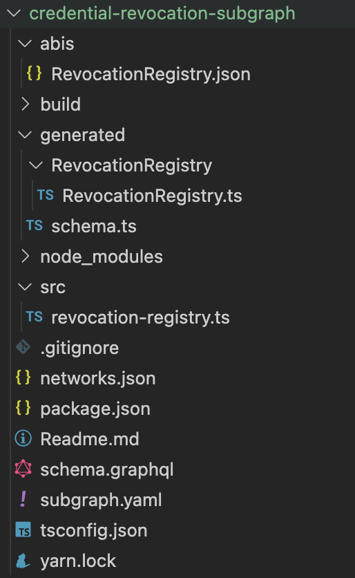
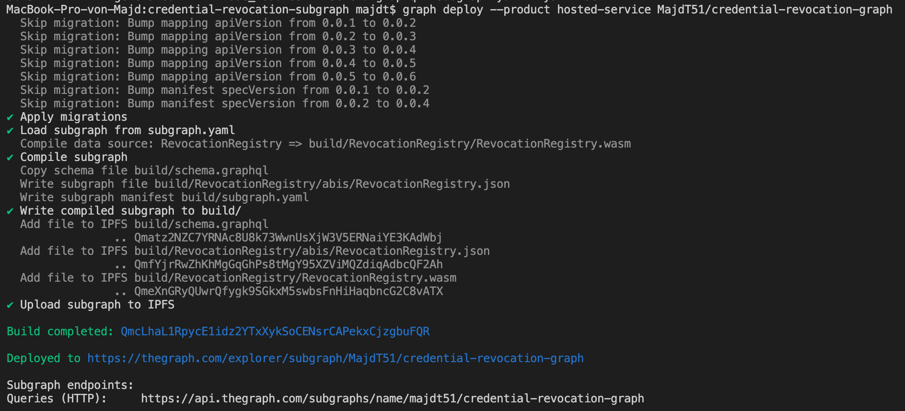
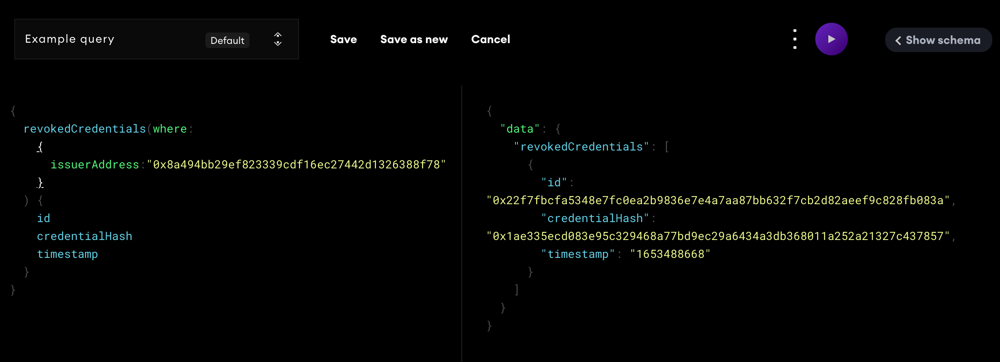

# Crednetial Revocation Subgraph

Unless required by applicable law or agreed to in writing, software distributed under the License is distributed on an "AS IS" BASIS, WITHOUT WARRANTIES OR CONDITIONS OF ANY KIND, either express or implied. See the License for the specific language governing permissions and limitations under the License.

A Sample Subgraph to index events which are emitted when a crednetial is revoked by an Issuer. This Sample could be modified to implement complexe entities and also index serveral events of related contracts like the EthereumDIDRegistry contract.

## Requirement 

* graph cli version 0.30.1
* yarn version 1.22.17
* The deployment scripts from `./ssi-contracts` executed successfully and the address of the revocation registry contract and the issuers are available

## Setup and Deployment
The subgraph will be deployed on a hosted service because we are not using the Ethereum mainnet and also to keep it simple for the article. To deploy a subgraph on a hosted service you need first to sign in with github `https://thegraph.com/hosted-service/`. After that from the Dashboard a new Subgraph can be created by a click on `Add Subgraph` and adding a name e.g.`credential-revocation-graph` and subtitle.

Now we are ready create our sample subgraph using the follwoing steps:

* Create a new folder and open it with VSC.
* Open a new terminal and install the `graph cli` with `npm install -g @graphprotocol/graph-cli`
* Initilize a sample subgraph for the verification smart contract `graph init --product hosted-service <Github-Name>/credential-revocation-graph` and give 
    * Protocol · ethereum
    * Subgraph name · <Github-Name>/credential-revocation-graph
    * Directory to create the subgraph in · credential-revocation-graph
    * Ethereum network · goerli
    * Contract address · <the-address-of-the-deplyoed-revocation-contract>
    * Fetching ABI from Etherscan (this works only if the contract is verified)
    * Contract Name · RevocationRegistry
* Navigate to the generated subgraph directory `cd credential-revocation-graph` and then run `yarn install`
* In the `subgraph.yaml` check the contract address and add the `startBlock` number at which the contract is deployed. this will make the synchronization much faster because the indexing will start from the given blocknumber and all other old blocks will be ignored.
  ```yaml
      source:
        address: "<the-address-of-revocation-contract>"
        abi: RevocationRegistry
        startBlock: <the-block-number>
  ```
* Replace the code in `schema.graphql`. For better readabilty we replaced `issuer` with `issuerAddress` and `digset` with `credentialHash`. We also added the blockNumber and timestamp as extra properties which could be useful for some verification DApps.

  ```graphql
  type RevokedCredential @entity {
    id: ID!
    count: BigInt!
    issuerAddress: Bytes! # address
    credentialHash: Bytes! # bytes32
    blockNumber: BigInt!
    timestamp: BigInt!
  }
  ```
* Run `yarn codegen` to generated the related code for the new entity.
* Change the code under `src/revocation-registry` to handle the emitted event and store it inside the entity. In this function we could also run a smart contract call request to request extra data from the contract if needed

  ```ts
  export function handleRevoked(event: Revoked): void {
    let entity = RevokedCredential.load(event.transaction.hash.toHex())
    if (!entity) {
      entity = new RevokedCredential(event.transaction.hash.toHex())
      entity.count = BigInt.fromI32(0)
    }
    entity.count = BigInt.fromI32(1).plus(entity.count)
    entity.issuerAddress = event.params.issuer
    entity.credentialHash = event.params.digest
    entity.blockNumber = event.block.number
    entity.timestamp = event.block.timestamp
    entity.save()
  }
  ```
* Run `yarn build` to compile and build the subgraph.
* The project struct should now look like this

  

* Get the access token from the Dashboard and then run the auth command to be able to deploy the subgraph `graph auth --product hosted-service <access-token>`
* Deploy the subgraph `graph deploy --product hosted-service <Github-Name>/credential-revocation-graph`
* In the console you will get the following

  
* Now we can query the index data open `https://api.thegraph.com/subgraphs/name/<github-name>/credential-revocation-graph` in browser and run the following query to get the hashes of all credentials that are revoked by a your Issuer-A from `./ssi-contracts`

  
The Results should contain only 1 revoked crednetial, unless you modified the scripts in `./ssi-contract` or used an already existing contracts for this query. You can also compair the results with the logged data of the executed script in `./ssi-contract`
